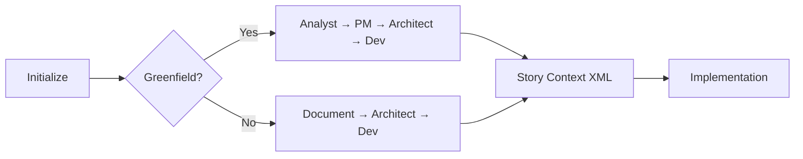

# BMAD Expert Agent Implementation Guide

## Executive Summary

After thorough analysis of your requirements, Gemini's recommendations, and the current state of technology (November 2025), here's the definitive guide for implementing your BMAD expert agent.

## Key Findings

### ✅ What's Real (November 2025)

1. **VS Code DOES have MCP support** - Full support since July 2025 (v1.102)
2. **BMAD v6-alpha.7** is the latest (released Nov 7, 2025)
3. **MCP servers work in VS Code** via `.vscode/mcp.json` configuration
4. **Full MCP spec** including tools, resources, prompts, and sampling

### ❌ What Gemini Got Wrong

1. **`task-master-ai` npm package doesn't exist** - Use `@modelcontextprotocol/server-memory` instead
2. **`.github/agents/` is not a VS Code pattern** - MCP servers go in separate directories
3. **`@BMAD_Expert` dropdown doesn't work that way** - Use MCP prompts instead
4. **AGENTS.md files aren't recognized** - Use proper MCP server implementation

## Your Implementation Options

### Option 1: MCP Server Approach (RECOMMENDED) ✅

I've created a proper MCP server for you in `/bmad-expert-mcp/`:

**Features:**
- Tools for phase detection, workflow validation, agent recommendation
- Resources for BMAD knowledge base access
- Pre-configured prompts for common BMAD operations
- Proper integration with VS Code's MCP support

**Setup:**
```bash
cd bmad-expert-mcp
npm install
# Server will auto-start when VS Code loads the MCP configuration
```

**Usage in VS Code:**
1. Open VS Code Command Palette (Ctrl+Shift+P)
2. Run "MCP: List Servers" to see your BMAD Expert
3. In GitHub Copilot Chat, use:
   - Tools: `#bmad_check_phase`, `#bmad_validate_workflow`
   - Prompts: `/mcp.bmadExpert.init_session`
   - Resources: Add via "Add Context" > "MCP Resources"

### Option 2: BMAD Native Approach ✅

Use BMAD's built-in agent system:

```bash
# Install BMAD properly (avoiding the memory issue)
npx bmad-method@alpha install --no-interactive

# Use built-in agents
*workflow-init  # Determine Greenfield vs Brownfield
*agent analyst  # Start with analysis phase
*agent pm       # Move to planning
```

### Option 3: Claude Project Approach ✅

Create a Claude Project with BMAD knowledge:

1. Go to claude.ai/projects
2. Create "BMAD Expert" project
3. Upload BMAD documentation
4. Add custom instructions (see below)

**Custom Instructions:**
```markdown
You are a BMAD-METHOD v6-alpha expert. Always:

1. Check current phase before recommending workflows
2. Enforce Greenfield vs Brownfield distinction
3. Use correct agent for each phase:
   - Phase 1 (Analysis): Analyst
   - Phase 2 (Planning): PM
   - Phase 3 (Solutioning): Architect
   - Phase 4 (Implementation): Dev/SM
   - Phase 5 (Testing): QA

4. Validate Story Context XML in Phase 4
5. Recommend document sharding for >40k tokens
6. Follow Plan → Build → Verify pipeline
```

## Gemini's Framework Recommendations: Reality Check

| Framework | Gemini's Take | Reality | When to Actually Use |
|-----------|--------------|---------|---------------------|
| Dual-Layer | "Best for expert partner" | Overcomplicated | Just use MCP servers |
| LangGraph | "For automation" | Valid but overkill | Only for complex orchestration |
| PydanticAI | "For repetitive tasks" | Good choice | Structured outputs |
| CrewAI | "For brainstorming" | Unnecessary | BMAD agents do this |

## Best Practices for BMAD Integration

### 1. Project Structure
```
true-valence-mapper-bmad/
├── .vscode/
│   └── mcp.json          # ✅ Correct location
├── bmad-expert-mcp/      # ✅ MCP server
│   ├── package.json
│   └── index.js
├── .bmad/                # Will be created by BMAD
│   ├── agents/
│   ├── workflows/
│   └── blueprints/
└── docs/
    ├── prd.md           # Phase 2 output
    └── architecture.md  # Phase 3 output
```

### 2. Workflow Sequence



### 3. Token Economy

With BMAD's document sharding + your SuperClaude compression:
- Phase 1-3: Load full documents
- Phase 4: Load only relevant story sections
- Use `INDEX_GUIDED` strategy for navigation
- Expected 90% token reduction on large projects

## Integration with Your SuperClaude System

Your existing configuration complements BMAD well:

```yaml
# In your superclaude-personas.yml
BMAD_Master:
  activation: "bmad, workflow validation, phase transition"
  expertise: "BMAD v6-alpha methodology, agent orchestration"
  flags:
    - --uc  # Use ultra-compressed mode for large PRDs
    - --validate  # Always validate workflows
  integration:
    mcp_servers:
      - bmadExpert  # Your custom MCP server
    dart_integration: "Track BMAD stories as Dart tasks"
```

## Common Pitfalls to Avoid

1. **Don't mix phases** - Complete planning before implementation
2. **Don't skip Story Context XML** - It's crucial for Phase 4
3. **Don't ignore document sharding** - Memory limits are real
4. **Don't use wrong agent** - Each has specific expertise
5. **Don't trust Gemini blindly** - Verify claims against documentation

## Testing Your Setup

```bash
# 1. Test MCP server
cd bmad-expert-mcp
npm install
node index.js  # Should output "BMAD Expert MCP Server running..."

# 2. In VS Code
# Open Command Palette → "MCP: List Servers"
# You should see "bmadExpert" in the list

# 3. In Copilot Chat
# Type: /mcp.bmadExpert.init_session
# Should analyze your project and recommend next steps
```

## Troubleshooting

### If MCP server doesn't appear:
1. Check VS Code version (must be 1.102+)
2. Enable `chat.mcp.enabled` in settings
3. Restart VS Code after configuration changes

### If BMAD install fails:
1. Use `--no-interactive` flag
2. Increase Node memory: `NODE_OPTIONS="--max-old-space-size=4096"`
3. Install in smaller chunks

### If workflows don't execute:
1. Verify you're in correct phase
2. Check agent prerequisites
3. Ensure Story Status == Approved (Phase 4)

## Next Steps

1. **Install dependencies:**
   ```bash
   cd bmad-expert-mcp && npm install
   ```

2. **Test MCP integration:**
   - Open VS Code
   - Check MCP servers list
   - Try init_session prompt

3. **Initialize BMAD project:**
   ```bash
   npx bmad-method@alpha install --no-interactive
   *workflow-init
   ```

4. **Start with Phase 1:**
   - Determine Greenfield vs Brownfield
   - Use appropriate agent
   - Follow BMAD methodology

## Conclusion

Your BMAD expert agent concept is sound, but Gemini's implementation details were outdated/incorrect. The MCP server approach I've implemented gives you:

- ✅ Real VS Code integration (not imaginary)
- ✅ Proper BMAD methodology enforcement
- ✅ Phase-aware recommendations
- ✅ Workflow validation
- ✅ Integration with your existing SuperClaude system

The future is here (November 2025), and the tools are more capable than Gemini suggested - just different from what was described.

---

*Generated with comprehensive analysis of BMAD v6-alpha.7, VS Code MCP support (GA July 2025), and your specific project requirements.*