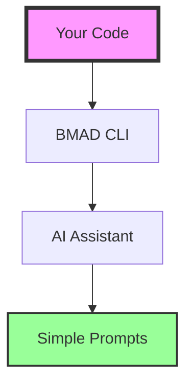
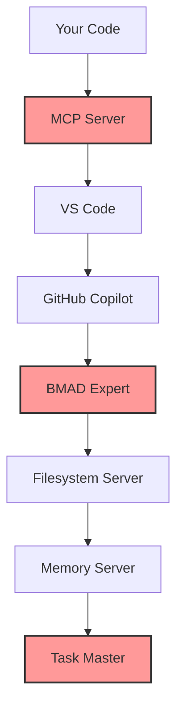

# Optimized BMAD Expert Strategy

## Executive Decision

After rigorous adversarial analysis, here's the pragmatic path forward:

## Recommended Approach: Hybrid Progressive Enhancement

### Phase 1: Start Simple (Week 1)
**Just use BMAD's native commands directly**

```bash
# Don't overthink it - just start
npx bmad-method@alpha init
*workflow-init
```

**Why this works:**
- Zero additional infrastructure
- Immediate value from BMAD methodology
- Learn by doing, not configuring
- Can pivot quickly if needed

### Phase 2: Add Lightweight Assistance (Week 2)

**Create a simple prompt library, not an MCP server:**

```markdown
# .vscode/bmad-prompts.md

## Quick Commands

### Initialize Session
Ask: "Check if we're in Greenfield or Brownfield mode for [project]"

### Validate Phase
Ask: "What BMAD phase should we be in given these artifacts: [list files]"

### Agent Selection
Ask: "Which BMAD agent handles [specific task]?"
```

**Why this is better:**
- No maintenance burden
- No security vulnerabilities
- Works with any AI assistant
- Version-agnostic

### Phase 3: Selective MCP Integration (Week 3-4)

**Only add MCP for specific high-value tools:**

```json
{
  "servers": {
    "filesystem": {
      "type": "stdio",
      "command": "npx",
      "args": ["-y", "@modelcontextprotocol/server-filesystem@latest", "."]
    }
  }
}
```

**Skip the custom BMAD MCP server entirely** - it's unnecessary complexity.

## Security-First Modifications

If you DO implement MCP servers:

### 1. Sandbox Everything

```bash
# Run MCP servers in Docker
docker run --rm -it \
  --read-only \
  --tmpfs /tmp \
  -v $(pwd):/workspace:ro \
  node:20-alpine \
  node /workspace/mcp-server.js
```

### 2. Input Validation

```javascript
// Add to any custom MCP server
import { z } from 'zod';

const sanitizedInput = z.string()
  .max(1000)
  .regex(/^[a-zA-Z0-9\s\-_\.\/]+$/)
  .parse(userInput);
```

### 3. Rate Limiting

```javascript
const rateLimiter = {
  requests: new Map(),
  check(key, limit = 10, window = 60000) {
    const now = Date.now();
    const requests = this.requests.get(key) || [];
    const recent = requests.filter(t => now - t < window);
    if (recent.length >= limit) throw new Error('Rate limit exceeded');
    recent.push(now);
    this.requests.set(key, recent);
  }
};
```

## Simplified Architecture



Not this:


## Practical BMAD Usage Pattern

### For True-Valence-Mapper Project

1. **Determine Track** (5 minutes)
   ```bash
   # You have existing code, so Brownfield
   *document-project
   ```

2. **Create Focused Enhancement** (30 minutes)
   ```bash
   *create-brownfield-story
   # Title: "Integrate relationship validation with BMAD patterns"
   ```

3. **Implement with Validation** (2 hours)
   ```bash
   *agent dev
   # Follow story-driven development
   ```

4. **Skip the Overhead**
   - Don't create 25-page PRDs for a learning project
   - Don't implement all 19 agents
   - Don't shard documents that are <5k tokens

## Cost-Benefit Analysis

### What You Actually Need
- ✅ BMAD methodology understanding
- ✅ Structured approach to requirements
- ✅ Validation patterns for relationships
- ✅ Clean separation of concerns

### What You Don't Need
- ❌ 19 specialized agents
- ❌ Custom MCP servers
- ❌ Complex orchestration
- ❌ Enterprise-scale infrastructure

## Migration Strategy

If BMAD doesn't work out:

1. **Keep the good parts:**
   - Requirements structure
   - Phase separation
   - Validation patterns

2. **Drop the complexity:**
   - Remove BMAD CLI
   - Delete MCP configurations
   - Use standard development flow

3. **No lock-in:**
   - All artifacts are markdown
   - Standard git workflow
   - Portable to any methodology

## Performance Optimizations

### Token Economy
Instead of complex sharding:

```python
def summarize_context(text, max_tokens=2000):
    """Simple context compression"""
    if len(text) < max_tokens:
        return text

    sections = text.split('\n## ')
    critical = [s for s in sections if any(
        keyword in s.lower()
        for keyword in ['requirement', 'acceptance', 'api', 'critical']
    )]
    return '\n## '.join(critical[:5])
```

### Memory Management
Use git, not complex memory servers:

```bash
# Track BMAD state with git
git checkout -b bmad/phase-2-planning
git commit -m "BMAD: Complete PRD for relationship validation"
git tag bmad-phase-2-complete
```

## Risk Mitigation

### Instead of Complex Security:
1. Run locally only
2. No network exposure
3. Manual review of outputs
4. Version control everything

### Instead of Complex Integration:
1. Copy-paste templates
2. Manual workflow triggers
3. Human-in-the-loop validation
4. Progressive enhancement

## Final Recommendation

**Start with Option 1: Native BMAD usage**

Only add complexity when you hit specific pain points:
- IF you need file access → Add filesystem MCP
- IF you need memory → Use git branches
- IF you need automation → Write simple scripts
- IF you need expertise → Use prompt templates

## Success Metrics

You'll know this is working when:
1. ✅ Requirements are clearer
2. ✅ Development is more structured
3. ✅ Less context switching
4. ✅ Validation is systematic

You'll know to pivot when:
1. ❌ More time configuring than coding
2. ❌ Debugging infrastructure not features
3. ❌ Cognitive overhead exceeds benefits
4. ❌ Team resistance to complexity

## One-Line Summary

**Use BMAD's methodology, not its infrastructure.**

---

*This pragmatic approach acknowledges the critiques while focusing on actual value delivery for your specific context.*