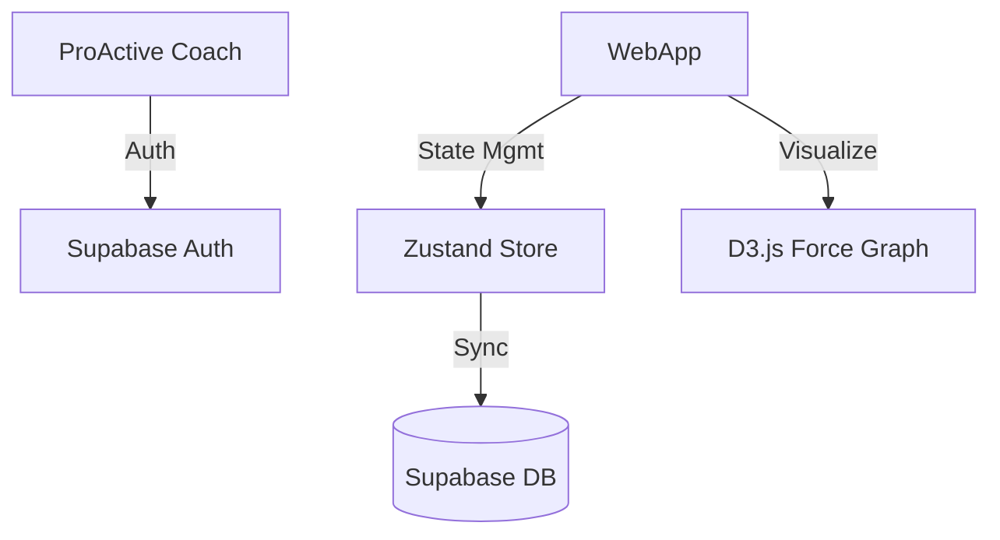

# System Architecture: True Valence Mapper (MVP Pilot)
*BMAD Phase 3: Solutioning*
*Architect: Winston*

## 1. Architectural Principles
-   **Client-Side First:** Logic remains in browser, but data syncs to cloud.
-   **Data Safety:** Supabase PostgreSQL ensures no data is lost if browser cache is cleared.
-   **Auth:** Supabase Auth (Magic Link or Email/Password) for secure access.
-   **Session Persistence:** Cloud-synced via Supabase Client.

## 2. High-Level Diagram


## 3. Data Model (JSON Schema)
The core data structure for a session snapshot.

```typescript
interface SessionSnapshot {
  meta: {
    coachId: string;
    clientContext: string; // e.g., "John Doe - Q4 Review"
    timestamp: string; // ISO 8601
    schemaVersion: "1.0";
  };
  nodes: {
    id: string;
    name: string;
    role: "Direct Report" | "Manager" | "Peer" | "Stakeholder" | "Mentor";
    group?: string;
  }[];
  links: {
    source: string;
    target: string;
    type: "Reporting" | "Collaboration" | "Advisory";
  }[];
  valence: {
    [linkId: string]: {
      trust: number; // -5 to +5
      communication: number;
      support: number;
      respect: number;
      alignment: number;
      notes?: string;
    };
  };
}
```

## 4. Component Architecture
-   **`App`**: Main container, handles routing (if any) and auth check.
-   **`AuthGate`**: Checks email against allowed list.
-   **`Workspace`**: The main editing environment.
    -   **`GraphCanvas`**: D3.js wrapper for visualization.
    -   **`Sidebar`**: Controls for adding nodes and editing valence.
    -   **`ValenceEditor`**: Form for the 5 dimensions.
    -   **`Toolbar`**: Save, Load, Export, Snapshot buttons.

## 5. Security & Privacy (MVP)
-   **Data Storage:** Supabase PostgreSQL (Cloud).
-   **Row Level Security (RLS):** Policies to ensure coaches can ONLY see their own clients' data.
-   **Authentication:** Supabase Auth handles secure login/session management.
